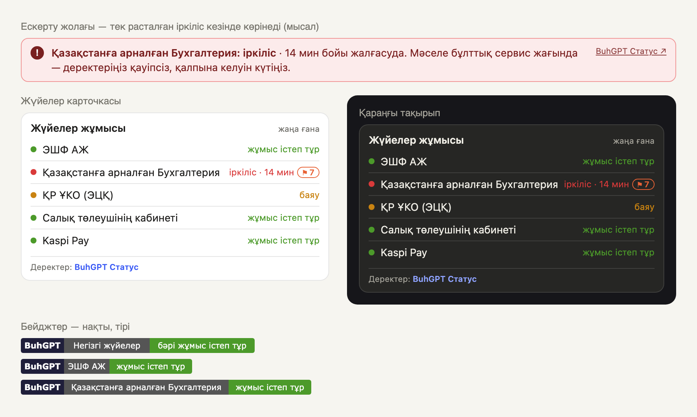

<p align="center">
  <a href="https://buhgpt.kz/status/"></a>
</p>

<p align="center">
  <a href="README.md">Русский</a> · <b>Қазақша</b>
</p>

<p align="center">
  <a href="https://buhgpt.kz/status/"></a>
  <a href="https://buhgpt.kz/status/esf/"></a>
  <a href="https://buhgpt.kz/status/1c-fresh-buhgalteriya/"></a>
</p>

<p align="center">
  <a href="openapi.yaml"></a>
  <a href="DATA-TERMS.md"></a>
  
  <a href="LICENSE"></a>
</p>

<h3 align="center">Іркіліс сервисте ме, әлде сізде ме — 5 секундта көрінеді</h3>

<p align="center">
  <a href="https://buhgpt.kz/status/"><b>Жүйелердің жұмыс күйі</b></a> ·
  <a href="https://buhgpt.kz/status/api.html">Құжаттама</a> ·
  <a href="https://buhgpt.kz/status/widget.html">Виджет конструкторы</a> ·
  <a href="openapi.yaml">OpenAPI</a> ·
  <a href="SERVICES.md">49 жүйе</a>
</p>

---

[BuhGPT Статус](https://buhgpt.kz/status/) Қазақстандағы бухгалтер жұмыс істей алмайтын жүйелерді әр 1–5 минут сайын тексереді:
ЭШФ АЖ, ТІЖ, ҚР ҰКО (ЭЦҚ), Салық төлеушінің кабинеті, eGov, 1С:Fresh, банктер, ФДО және мемлекеттік сервистер —
және бұл деректерді тегін береді: **JSON API, сайтқа арналған виджет және бейджтер**.

## Қалай көрінеді

<p align="center"></p>

<p align="center"><sub>Ескерту жолағы іркіліс мысалында көрсетілген. Суреттегі және тақырыптағы бейджтер — тірі.</sub></p>

## Не үшін

ЭШФ жіберілмей ме, 1С:Fresh ашылмай ма — бірінші сұрақ: іркіліс сервисте ме, әлде менде ме? Жауапты пайдаланушыларыңыз
іздейтін жерге қойыңыз: 1С, CRM, Telegram-бот, 1С-серіктестің сайты немесе ФДО кабинеті.

- **Сайттың ашылуы ғана емес, қосымшаның жұмысы тексеріледі**: ЭШФ және ТІЖ API, ҰКО-ның OCSP мен уақыт белгілері,
  кабинеттерге кіру, 1С:Fresh әр жариялануындағы 1С платформасы.
- **Бір қате — іркіліс емес**: 20 секундтан кейін қайта тексеру, іркіліс қатарынан үш сәтсіз тексеруден кейін тіркеледі.
- **Ұзақтығы көрсетілген инциденттер** — іркіліс қашан басталды және қолжетімділік қанша уақыт шектелді.
- **Жаңартулар мен техникалық жұмыстар** — 1С:Fresh ресми хабарландырулары және автоматты түрде анықталған жаңа нұсқалар.
- **Пайдаланушы хабарламалары** — соңғы сағатта қанша түрлі желі мәселе туралы хабарлады.
- Әр жауапта **қазақша және орысша**.

## Жылдам бастау

```bash
curl -s "https://buhgpt.kz/status/api/pulse/v1/context?service=esf&lang=kk"
```

```json
{
  "service_id": "esf",
  "service_name": "ЭШФ АЖ",
  "status": "OPERATIONAL",
  "status_label": "Жұмыс істеп тұр",
  "is_problem_on_provider_side": false,
  "fresh": true,
  "advice": "BuhGPT Статус деректері бойынша «ЭШФ АЖ» қазір жұмыс істеп тұр. Қатенің себебі, мүмкін, пайдаланушы жағында: ЭЦҚ, NCALayer, 1С баптаулары немесе интернет.",
  "attribution": "Деректер: BuhGPT Статус — buhgpt.kz/status",
  "source_url": "https://buhgpt.kz/status/esf/",
  "provider": { "name": "BuhGPT Статус", "url": "https://buhgpt.kz/status/", "attribution": "Деректер: BuhGPT Статус — buhgpt.kz/status" }
}
```

Дайын мысалдар: [curl](examples/curl.sh) · [JavaScript](examples/browser.html) · [Node.js](examples/node.mjs) ·
[Python](examples/python.py) · [1С (орыс синтаксисі)](examples/1c-ru.bsl) · [1С (ағылшын синтаксисі)](examples/1c-en.bsl) ·
[PHP](examples/php.php) · [Telegram-бот](examples/telegram_bot.py)

## Әдістер

Негізгі мекенжай: `https://buhgpt.kz/status/api/pulse/v1`

| Әдіс | Не береді |
|---|---|
| `GET /context?service={id}` | Бір жүйенің күйі және пайдаланушыға дайын кеңес — 1С, боттар мен чаттар үшін ең жақсы нұсқа |
| `GET /summary` | Барлық жүйелер топтар бойынша: күйі, сағаттағы хабарламалар, соңғы іркіліс және оның ұзақтығы, ағымдағы инциденттер |
| `GET /services/{id}` | 1/7/30/90 күндегі қолжетімділік, тоқтап қалу, инциденттер, жаңартулар, жауап уақыты, 2 сағаттағы хабарламалар |
| `GET /uptime?days=90` | Әр жүйенің әр күнінің қорытындысы |
| `GET /incidents?days=14` | Хронологиясы және ұзақтығы бар инциденттер |
| `GET /incidents/{id}` | Бір инцидент («Инцидентті тіркеу туралы анықтама» деректері) |
| `GET /announcements?days=90` | Жаңартулар, техникалық жұмыстар, операторлардың хабарландырулары |
| `GET /checks` | Әр жүйе бойынша не және қаншалықты жиі тексеріледі |
| `GET /widget?services=...` | Өз виджетіңізге арналған жеңіл жауап (кэш 30 с) |

Өрістердің толық сипаттамасы — [openapi.yaml](openapi.yaml). Жүйелердің идентификаторлары — [SERVICES.md](SERVICES.md).

**Күйлер:** `OPERATIONAL` — жұмыс істеп тұр · `DEGRADED` — баяу жұмыс · `PARTIAL_OUTAGE` — ішінара іркіліс · `MAJOR_OUTAGE` — іркіліс ·
`MAINTENANCE` — жарияланған жұмыстар · `UNKNOWN` — жаңа деректер жоқ (мұны іркіліс деп санамаңыз).

**Тіл:** `?lang=kk` немесе `?lang=ru` → болмаса `Accept-Language` тақырыбы → болмаса қазақша.

**Уақыт:** Unix-секунд (UTC). `/uptime` ішіндегі күндер — Астана уақыты бойынша (UTC+5).

## Сайтқа арналған виджет және бейджтер

Код конструкторда жиналады: **https://buhgpt.kz/status/widget.html**. Толығырақ — [widget/README.md](widget/README.md).

```html
<!-- Жүйелер карточкасы, минутына бір рет жаңарады -->
<script src="https://buhgpt.kz/status/widget.js" data-services="esf,fresh_ea,nuc,kaspi" data-lang="kk" async></script>

<!-- Ескерту жолағы: тек расталған іркіліс немесе жұмыстар кезінде көрінеді -->
<script src="https://buhgpt.kz/status/widget.js" data-mode="alert" data-services="esf,fresh_ea" data-lang="kk" async></script>

<!-- Скриптсіз бейдж: сайт, README, хат, 1С HTML-өрісі -->
<a href="https://buhgpt.kz/status/esf/"></a>
```

## Шарттар

- **Тегін**, оның ішінде коммерциялық өнімдерде. Кілт пен тіркеу қажет емес.
- Деректердің жанында **дереккөзді көрсетіңіз**: «Деректер: BuhGPT Статус — buhgpt.kz/status» (дайын мәтін `provider.attribution` ішінде). Виджеттегі жазуды алып тастамаңыз. Толығырақ — [DATA-TERMS.md](DATA-TERMS.md).
- **Шектеу** — бір IP-ден минутына 120 сұрау. Деректер 1–5 минутта бір рет жаңарады, 30 секундта бір реттен жиі сұраудың қажеті жоқ.
- Бұл мемлекеттік органдардың, банктер мен операторлардың ресми дереккөзі емес, **тәуелсіз автоматты тексерулер**. API қолжетімділігіне кепілдік жоқ.

Мысалдар мен құжаттаманың коды — [MIT](LICENSE).

## Тағы бір жүйе керек пе?

[Issue ашыңыз](../../issues/new?template=new-system.yml) — қандай жүйені тексеру керектігін және ол бухгалтерге неге маңызды екенін жазыңыз.

---

**BuhGPT** — Қазақстан бухгалтерлеріне арналған ЖИ-көмекші: [buhgpt.kz](https://buhgpt.kz)
