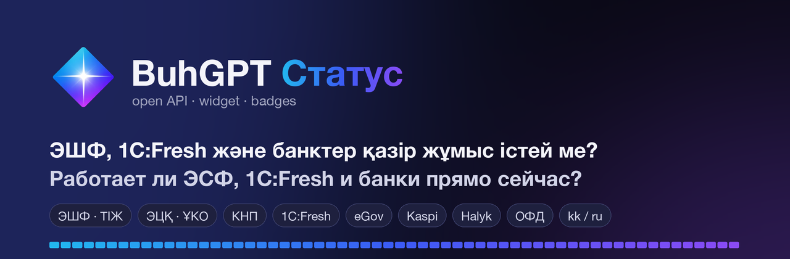
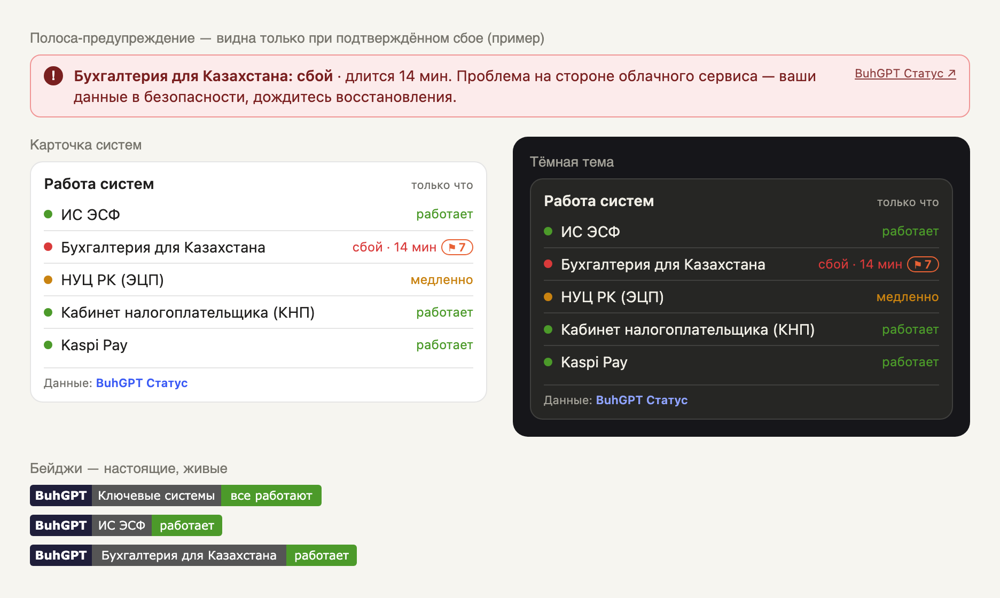

<p align="center">
  <a href="https://buhgpt.kz/status/ru/"></a>
</p>

<p align="center">
  <b>Русский</b> · <a href="README.kk.md">Қазақша</a>
</p>

<p align="center">
  <a href="https://buhgpt.kz/status/ru/"></a>
  <a href="https://buhgpt.kz/status/ru/esf/"></a>
  <a href="https://buhgpt.kz/status/ru/1c-fresh-buhgalteriya/"></a>
</p>

<p align="center">
  <a href="openapi.yaml"></a>
  <a href="DATA-TERMS.md"></a>
  
  <a href="LICENSE"></a>
</p>

<h3 align="center">Сбой в сервисе или у вас — видно за 5 секунд</h3>

<p align="center">
  <a href="https://buhgpt.kz/status/ru/"><b>Статус систем</b></a> ·
  <a href="https://buhgpt.kz/status/ru/api.html">Документация</a> ·
  <a href="https://buhgpt.kz/status/ru/widget.html">Конструктор виджета</a> ·
  <a href="openapi.yaml">OpenAPI</a> ·
  <a href="SERVICES.md">49 систем</a>
</p>

---

[BuhGPT Статус](https://buhgpt.kz/status/ru/) каждые 1–5 минут проверяет системы, без которых бухгалтер в Казахстане
не может работать: ИС ЭСФ, СНТ, НУЦ РК (ЭЦП), кабинет налогоплательщика, eGov, 1С:Fresh, банки, ОФД и госсервисы —
и отдаёт эти данные бесплатно: **JSON API, виджет для сайта и бейджи**.

## Как это выглядит

<p align="center"></p>

<p align="center"><sub>Полоса-предупреждение показана на примере сбоя. Бейджи на картинке и в шапке — живые.</sub></p>

## Зачем

Когда не уходит ЭСФ или не открывается 1С:Fresh, первый вопрос — сбой у сервиса или у меня? Встройте ответ туда,
где его ищут ваши пользователи: в 1С, CRM, Telegram-бот, сайт 1С-партнёра или кабинет ОФД.

- **Проверяется работа приложений, а не только «открывается ли сайт»**: API ЭСФ и СНТ, OCSP и штампы времени НУЦ,
  вход в кабинеты, платформа 1С у каждой публикации 1С:Fresh.
- **Одна ошибка — не сбой**: перепроверка через 20 секунд, сбой фиксируется после трёх неудачных проверок подряд.
- **Инциденты с длительностью** — когда начался сбой и сколько длилось ограничение доступа.
- **Обновления и технические работы** — официальные объявления 1С:Fresh и автоматически обнаруженные новые версии.
- **Сообщения пользователей** — сколько разных сетей за час сообщили о проблеме.
- **Казахский и русский** в каждом ответе.

## Быстрый старт

```bash
curl -s "https://buhgpt.kz/status/api/pulse/v1/context?service=esf&lang=ru"
```

```json
{
  "service_id": "esf",
  "service_name": "ИС ЭСФ",
  "status": "OPERATIONAL",
  "status_label": "Работает",
  "is_problem_on_provider_side": false,
  "fresh": true,
  "advice": "По данным BuhGPT Статус, «ИС ЭСФ» сейчас работает. Причина ошибки, скорее всего, на стороне пользователя: ЭЦП, NCALayer, настройки 1С или интернет.",
  "attribution": "Данные: BuhGPT Статус — buhgpt.kz/status",
  "source_url": "https://buhgpt.kz/status/ru/esf/",
  "provider": { "name": "BuhGPT Статус", "url": "https://buhgpt.kz/status/ru/", "attribution": "Данные: BuhGPT Статус — buhgpt.kz/status" }
}
```

Готовые примеры: [curl](examples/curl.sh) · [JavaScript](examples/browser.html) · [Node.js](examples/node.mjs) ·
[Python](examples/python.py) · [1С (русский синтаксис)](examples/1c-ru.bsl) · [1С (английский синтаксис)](examples/1c-en.bsl) ·
[PHP](examples/php.php) · [Telegram-бот](examples/telegram_bot.py)

## Методы

Базовый адрес: `https://buhgpt.kz/status/api/pulse/v1`

| Метод | Что отдаёт |
|---|---|
| `GET /context?service={id}` | Статус одной системы и готовый совет пользователю — лучший вариант для 1С, ботов и чатов |
| `GET /summary` | Все системы по группам: статус, жалобы за час, последний сбой и его длительность, текущие инциденты |
| `GET /services/{id}` | Доступность за 1/7/30/90 дней, простой, инциденты, обновления, время ответа, жалобы за 2 часа |
| `GET /uptime?days=90` | Итог каждого дня по каждой системе |
| `GET /incidents?days=14` | Инциденты с хронологией и длительностью |
| `GET /incidents/{id}` | Один инцидент (данные «Справки о фиксации инцидента») |
| `GET /announcements?days=90` | Обновления, технические работы, объявления операторов |
| `GET /checks` | Что проверяется по каждой системе и как часто |
| `GET /widget?services=...` | Лёгкий ответ для своего виджета (кэш 30 с) |

Полное описание полей — [openapi.yaml](openapi.yaml). Идентификаторы систем — [SERVICES.md](SERVICES.md).

**Статусы:** `OPERATIONAL` — работает · `DEGRADED` — задержки · `PARTIAL_OUTAGE` — частичный сбой · `MAJOR_OUTAGE` — сбой ·
`MAINTENANCE` — объявленные работы · `UNKNOWN` — нет свежих данных (не считайте это сбоем).

**Язык:** `?lang=kk` или `?lang=ru` → иначе заголовок `Accept-Language` → иначе казахский.

**Время:** Unix-секунды (UTC). Дни в `/uptime` — по времени Астаны (UTC+5).

## Виджет и бейджи для сайта

Код собирается в конструкторе: **https://buhgpt.kz/status/ru/widget.html**. Подробно — [widget/README.md](widget/README.md).

```html
<!-- Карточка систем, обновляется раз в минуту -->
<script src="https://buhgpt.kz/status/widget.js" data-services="esf,fresh_ea,nuc,kaspi" async></script>

<!-- Полоса-предупреждение: видна только при подтверждённом сбое или работах -->
<script src="https://buhgpt.kz/status/widget.js" data-mode="alert" data-services="esf,fresh_ea" async></script>

<!-- Бейдж без скриптов: сайт, README, письмо, HTML-поле в 1С -->
<a href="https://buhgpt.kz/status/ru/esf/"></a>
```

## Условия

- **Бесплатно**, в том числе в коммерческих продуктах. Ключи и регистрация не нужны.
- **Указывайте источник** рядом с данными: «Данные: BuhGPT Статус — buhgpt.kz/status» (готовый текст в `provider.attribution`). Не убирайте подпись в виджете. Подробно — [DATA-TERMS.md](DATA-TERMS.md).
- **Лимит** — 120 запросов в минуту с одного IP. Данные обновляются раз в 1–5 минут, опрашивать чаще раза в 30 секунд не нужно.
- Это **независимые автоматические проверки**, а не официальный источник госорганов, банков и операторов. Гарантий доступности API нет.

Код примеров и документации — [MIT](LICENSE).

## Нужна ещё одна система?

[Откройте issue](../../issues/new?template=new-system.yml) — напишите, какую систему проверять и почему она важна бухгалтеру.
Ошибка в данных или в API — [сюда](../../issues/new?template=bug.yml).

---

**BuhGPT** — ИИ-помощник для бухгалтеров Казахстана: [buhgpt.kz](https://buhgpt.kz)
